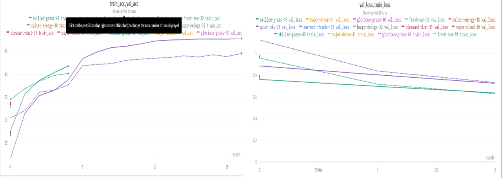
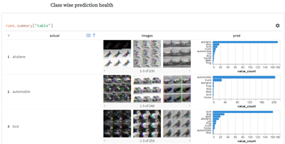
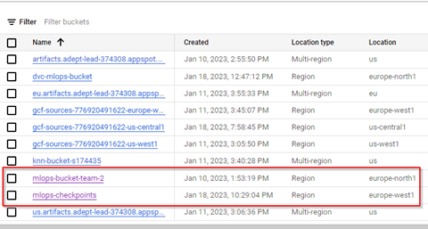
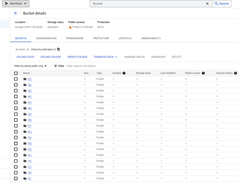
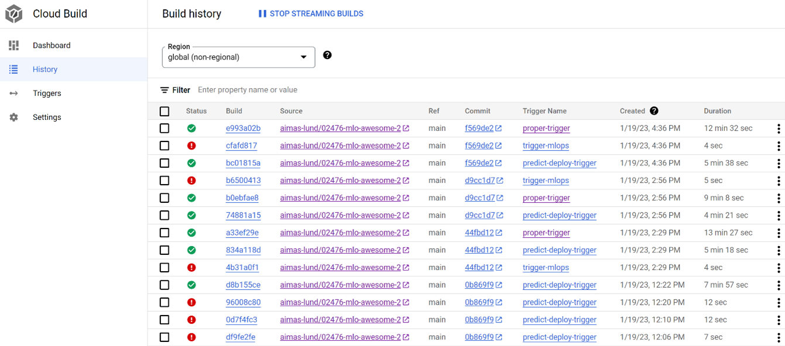
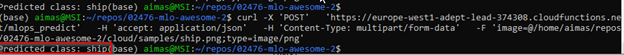
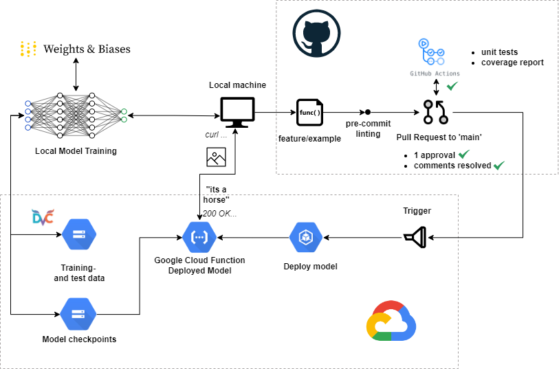

# Exam template for 02476 Machine Learning Operations

This is the report template for the exam. Please only remove the text formatted as with three dashes in front and behind
like:

```--- question 1 fill here ---```

where you instead should add your answers. Any other changes may have unwanted consequences when your report is auto
generated in the end of the course. For questions where you are asked to include images, start by adding the image to
the `figures` subfolder (please only use `.png`, `.jpg` or `.jpeg`) and then add the following code in your answer:

```markdown

```

In addition to this markdown file, we also provide the `report.py` script that provides two utility functions:

Running:

```bash
python report.py html
```

will generate an `.html` page of your report. After deadline for answering this template, we will autoscrape
everything in this `reports` folder and then use this utility to generate an `.html` page that will be your serve
as your final handin.

Running

```bash
python report.py check
```

will check your answers in this template against the constrains listed for each question e.g. is your answer too
short, too long, have you included an image when asked to.

For both functions to work it is important that you do not rename anything. The script have two dependencies that can
be installed with `pip install click markdown`.

## Overall project checklist

The checklist is *exhaustic* which means that it includes everything that you could possible do on the project in
relation the curricilum in this course. Therefore, we do not expect at all that you have checked of all boxes at the
end of the project.

### Week 1

* [ ] Create a git repository
* [ ] Make sure that all team members have write access to the github repository
* [ ] Create a dedicated environment for you project to keep track of your packages
* [ ] Create the initial file structure using cookiecutter
* [ ] Fill out the `make_dataset.py` file such that it downloads whatever data you need and
* [ ] Add a model file and a training script and get that running
* [ ] Remember to fill out the `requirements.txt` file with whatever dependencies that you are using
* [ ] Remember to comply with good coding practices (`pep8`) while doing the project
* [ ] Do a bit of code typing and remember to document essential parts of your code
* [ ] Setup version control for your data or part of your data
* [ ] Construct one or multiple docker files for your code
* [ ] Build the docker files locally and make sure they work as intended
* [ ] Write one or multiple configurations files for your experiments
* [ ] Used Hydra to load the configurations and manage your hyperparameters
* [ ] When you have something that works somewhat, remember at some point to to some profiling and see if
      you can optimize your code
* [ ] Use Weights & Biases to log training progress and other important metrics/artifacts in your code. Additionally,
      consider running a hyperparameter optimization sweep.
* [ ] Use Pytorch-lightning (if applicable) to reduce the amount of boilerplate in your code

### Week 2

* [ ] Write unit tests related to the data part of your code
* [ ] Write unit tests related to model construction and or model training
* [ ] Calculate the coverage.
* [ ] Get some continuous integration running on the github repository
* [ ] Create a data storage in GCP Bucket for you data and preferable link this with your data version control setup
* [ ] Create a trigger workflow for automatically building your docker images
* [ ] Get your model training in GCP using either the Engine or Vertex AI
* [ ] Create a FastAPI application that can do inference using your model
* [ ] If applicable, consider deploying the model locally using torchserve
* [ ] Deploy your model in GCP using either Functions or Run as the backend

### Week 3

* [ ] Check how robust your model is towards data drifting
* [ ] Setup monitoring for the system telemetry of your deployed model
* [ ] Setup monitoring for the performance of your deployed model
* [ ] If applicable, play around with distributed data loading
* [ ] If applicable, play around with distributed model training
* [ ] Play around with quantization, compilation and pruning for you trained models to increase inference speed

### Additional

* [ ] Revisit your initial project description. Did the project turn out as you wanted?
* [ ] Make sure all group members have a understanding about all parts of the project
* [ ] Uploaded all your code to github

## Group information

### Question 1
> **Enter the group number you signed up on <learn.inside.dtu.dk>**
>
> Answer: 

2

### Question 2
> **Enter the study number for each member in the group**
>
>
> Answer:

s174435, s184432, s210142, s213209, 

### Question 3
> **What framework did you choose to work with and did it help you complete the project?**
>
> Answer length: 100-200 words.
>
> Example:
> *We used the third-party framework ... in our project. We used functionality ... and functionality ... from the*
> *package to do ... and ... in our project*.
>
> Answer:


We used pytorch image models as the modelling framework for our project. We used the TIMM package. Of the several pretrained models available we decided to go with the resnet10t model [https://ieeexplore.ieee.org/document/9724001]. It is a lightweight model that uses less computing power compared to the other available pretrained models. It was trained on UC Merced Land Use Dataset [http://weegee.vision.ucmerced.edu/datasets/landuse.html]. Using a modelling framework and therefore a pretrained model helped us train faster as they come with an existing set of weights that can be initialized during training. That way the model does not have to train with randomly initialized weights.

## Coding environment

> In the following section we are interested in learning more about you local development environment.

### Question 4
> **Explain how you managed dependencies in your project? Explain the process a new team member would have to go**
> **through to get an exact copy of your environment.**
>
> Answer length: 100-200 words
>
> Example:
> *We used ... for managing our dependencies. The list of dependencies was auto-generated using ... . To get a*
> *complete copy of our development enviroment, one would have to run the following commands*
>
> Answer:

We used pip and a requirements.txt file to manage dependencies in our project. The list of dependencies was auto-generated using pip freeze and was included in the repository. To get a complete copy of our development environment, a new team member would have to first clone the repository, then navigate to the project directory and run the command "pip install -r requirements.txt" in their terminal. This command will install all the necessary dependencies listed in the requirements.txt file. Additionally, we are using FastAPI as web framework for our local model deployment instance. 


### Question 5

> **We expect that you initialized your project using the cookiecutter template. Explain the overall structure of your**
> **code. Did you fill out every folder or only a subset?**
>
> Answer length: 100-200 words
>
> Example:
> *From the cookiecutter template we have filled out the ... , ... and ... folder. We have removed the ... folder*
> *because we did not use any ... in our project. We have added an ... folder that contains ... for running our*
> *experiments.*
> Answer:

The following folders were utilised from the cookiecutter template:
* Data: This folder was used to store the CIFAR10 dataset. The data is hosted in the project’s GCP bucket “mlops-bucket-team-2”. A DVC pull fetches the data and puts it in the data folder. 
* Models: The best model thus obtained during training is saved into this folder. 
* src: Most important folder that stores all the scripts. Of which:
      * Data: Contains the code file handler.py that creates the training and test dataloaders from the source files. 
      * Models: Contains the code file train_model.py , predict_model.py as well as the config.yaml file which contains the models hyperparameters.
      * Visualizations: Used to save matplotlib graphs, before wandb was integrated into the source code.

Setup files that were used from the template are:
* Requirements.txt: Contains all the packages that need to be installed when a new member is setting up.
A few additional folders were created as below:
* Cloud: Contains the cloud function that will take an incoming image coming from a POST request and produce a prediction after passing it through the model. It also contains a folder for sample images where the image to be predicted can be placed. We decided to do this to have clear separation between code associated with training and code associated with cloud deployment.
* Outputs: Contains day and time stamp wise nested folders for every run. The logs from hydra and wandb were stored in these folders.

Files that were additionally created and added to the template are:
* .pre-commit-config.yaml : Pre-commit checks that are applied on an incoming commit to the github repository.
* Cloudbuild.yaml: Instructions to build the image container on GCP
* Trainer.dockerfile: Instructions to build the Docker image
* Requirements_test.txt: Containing python packages solely used for unit tests.

### Question 6

> **Did you implement any rules for code quality and format? Additionally, explain with your own words why these**
> **concepts matters in larger projects.**
>
> Answer length: 50-100 words.
>
> Answer:

For this, we used docstrings to document what the input and the outputs are for every function. Keywords such as “Args” and “returns” were used to indicate the inputs that the function expected and the outputs that the function gave respectively. 
Secondly, typing was used to rule out any ambiguity about the input data type to some of the functions. For instance, the class instantiated for the input dataset CIFAR10 indicated the datatype of the input data dimensions as well as the type of input to pass (Bool) when the CIFAR10Dataset (module to load the data) is called. Further, the train function receives the configuration from the yaml file which in turn has been declared as a dictionary. Such measures make the code more transferable and unambiguous. Especially in larger projects where the the development team could be huge and change through the course of the project, manual code handover may not be viable and using such coding standards makes the code easier to read to some extent.
Also we added a pre-commit file that checks compliance of the code before it is committed to the repository. We included a flake8 hook as well that would check for syntax errors, coding style violations, undefined or unused variables, etc.
Version control
In the following section we are interested in how version control was used in your project during development to corporate and increase the quality of your code.

## Version control

> In the following section we are interested in how version control was used in your project during development to
> corporate and increase the quality of your code.

### Question 7

> **How many tests did you implement and what are they testing in your code?**
>
> Answer length: 50-100 words.
>
> Example:
> *In total we have implemented X tests. Primarily we are testing ... and ... as these the most critical parts of our*
> *application but also ... .*
>
> Answer:

We have implemented a total of 5 unit tests. 1 unit test is for dataset fetching and formatting, ensuring that the data is handled correctly, before being used for training. For training, we have implemented 2 unit tests that check that a model can be trained without errors. These unit tests are a bit general, and future development should focus on developing unit tests for smaller segments of the training process. Lastly, there are 2 unit tests for the Google Cloud Function deployment implementation. These are especially important, as deploying to the cloud is a cumbersome task that would require a lot of time to handle, if errors would persist during deployment.

### Question 8

> **What is the total code coverage (in percentage) of your code? If you code had an code coverage of 100% (or close**
> **to), would you still trust it to be error free? Explain you reasoning.**
>
> Answer length: 100-200 words.
>
> Example:
> *The total code coverage of code is X%, which includes all our source code. We are far from 100% coverage of our **
> *code and even if we were then...*
>
> Answer:

The total code coverage of the code is 82%, which includes all our source code. The code coverage for individual files varies, with some files having a high coverage of over 90% and others having a lower coverage of 74% or 88%. For example, the ‘src/models/predict_model.py’ has a code coverage of 74% while ‘src/models/train_model.py’ has 80% and ‘src/data/handler.py’ has 88%. Even if we were to achieve 100% code coverage, it would not necessarily mean that the code is error-free. Code coverage simply measures the percentage of lines of code that have been executed during testing and does not guarantee that all possible inputs and edge cases have been thoroughly tested. Therefore, additional techniques such as manual testing and code reviews are also necessary to ensure code quality. 

### Question 9

> **Did you workflow include using branches and pull requests? If yes, explain how. If not, explain how branches and**
> **pull request can help improve version control.**
>
> Answer length: 100-200 words.
>
> Example:
> *We made use of both branches and PRs in our project. In our group, each member had an branch that they worked on in*
> *addition to the main branch. To merge code we ...*
>
> Answer:

Our team utilized a robust version control workflow with Git on GitHub utilizing branches and pull requests to collaborate effectively on our codebase. The main branch was meticulously maintained as the most recent, fully functional version of the code. To ensure the integrity of the main branch, direct commit pushes were prohibited. Each team member worked independently on their designated branches during the development process. Once the code was thoroughly tested and deemed ready for integration, it was committed and pushed to the branch repository. A pull request was then initiated, triggering a review process and request for merge into the main repository. Any conflicts that arose during the merge were promptly resolved, and the final commit required approval from at least one other team member using GitHub's built-in review system. This workflow allowed us to maintain a high level of code quality and ensure that only stable and tested code was merged into the main branch.

### Question 10

> **Did you use DVC for managing data in your project? If yes, then how did it improve your project to have version**
> **control of your data. If no, explain a case where it would be beneficial to have version control of your data.**
>
> Answer length: 100-200 words.
>
> Example:
> *We did make use of DVC in the following way: ... . In the end it helped us in ... for controlling ... part of our*
> *pipeline*
>
> Answer:

We used DVC to host the data for our project on the Google Cloud Platform, specifically in a bucket. Since our dataset CIFAR10 is a static dataset, we didn’t leverage the versioning functionality of DVC as we refrained from using any image augmentation. DVC could have come in handy if we tried different data augmentations, permutated with various model architectures and compared performance. Also, in case of the project where the data underwent multiple versions (such as a high velocity data environment where the model is trained, for instance, or different snapshots) having DVC would be useful in keeping a track of the combinations of data version and the model(s) that was trained on it.

### Question 11

> **Discuss you continues integration setup. What kind of CI are you running (unittesting, linting, etc.)? Do you test**
> **multiple operating systems, python version etc. Do you make use of caching? Feel free to insert a link to one of**
> **your github actions workflow.**
>
> Answer length: 200-300 words.
>
> Example:
> *We have organized our CI into 3 separate files: one for doing ..., one for running ... testing and one for running*
> *... . In particular for our ..., we used ... .An example of a triggered workflow can be seen here: <weblink>*
>
> Answer:

Our continuous integration setup is built around GitHub Actions. We have organized our CI pipeline into a single workflow file, which handles unit testing and coverage reporting.
For unit testing, we use the popular Pytest library, which allows us to easily write and run tests for our code. The line coverage of the unit tests are reported afterwards, using the coverage package, to give an overview of the test coverage.
We also make use of a pre-commit file, which allows us to run linting and other code quality checks before committing any changes. This helps us catch any issues early on and maintain a high level of code quality.
In addition to testing on a single operating system and Python version, we also test our code on multiple operating systems and Python versions to ensure compatibility and catch any platform-specific issues.
An example of one of our GitHub Actions workflow files can be found at https://github.com/aimas-lund/02476-mlo-awesome-2/actions/runs/3957234691/jobs/6777348964. 
We have also implemented a trigger on GCP which is following the main branch of our repository and deploys the model automatically as soon as we push code into the main branch. 
Overall, our CI pipeline is designed to provide comprehensive testing, code quality checks, and compatibility testing, helping us catch issues early on, and maintain an elevated level of code quality, saving time in the long run.


## Running code and tracking experiments

> In the following section we are interested in learning more about the experimental setup for running your code and
> especially the reproducibility of your experiments.

### Question 12

> **How did you configure experiments? Did you make use of config files? Explain with coding examples of how you would**
> **run a experiment.**
>
> Answer length: 50-100 words.
>
> Example:
> *We used a simple argparser, that worked in the following way: python my_script.py --lr 1e-3 --batch_size 25*
>
> Answer:

We used the Hydra library to configure experiments by creating a config.yaml file where we specified all the hyperparameters. We would run the experiments by using the command "python train_model.py" which would read the config file and use the specified hyperparameters. Other group members could run the command "python train_model.py params.batch_size=64 params.epochs=30" to override the specific hyperparameters in the config file and run the experiment with their desired values. This allowed us to easily manage and track all the different experiments we ran and allowed other members to easily reproduce our experiments.

### Question 13

> **Reproducibility of experiments are important. Related to the last question, how did you secure that no information**
> **is lost when running experiments and that your experiments are reproducible?**
>
> Answer length: 100-200 words.
>
> Example:
> *We made use of config files. Whenever an experiment is run the following happens: ... . To reproduce an experiment*
> *one would have to do ...*
>
> Answer:

To ensure that no information is lost when running experiments and that our experiments are reproducible, we made use of config files as well as version control. Every time an experiment is run, the config file and the code used for the experiment are committed to version control. This allows us to easily roll back to previous versions of the code and config files if necessary. Additionally, we also keep track of the experiment results, including the training logs, model weights and evaluation metrics in a centralized location.
To reproduce an experiment, one would have to check out the specific version of the code and config file used for that experiment and run the experiment using the same environment and dependencies. We also added version tracking of our dependencies, so that we can reproduce the experiment with the same environment and dependencies as it was run earlier.
Overall, our approach to configuring and running experiments helped us to maintain reproducibility and traceability of our experiments.


### Question 14

> **Upload 1 to 3 screenshots that show the experiments that you have done in W&B (or another experiment tracking**
> **service of your choice). This may include loss graphs, logged images, hyperparameter sweeps etc. You can take**
> **inspiration from [this figure](figures/wandb.png). Explain what metrics you are tracking and why they are**
> **important.**
>
> Answer length: 200-300 words + 1 to 3 screenshots.
>
> Example:
> *As seen in the first image when have tracked ... and ... which both inform us about ... in our experiments.*
> *As seen in the second image we are also tracking ... and ...*
>
> Answer:

In the first image we can see the training and validation accuracies plotted across the epochs, which was one of the hyperparameters during training. The figure captures only the first 10 finished runs. The equivalent plot for training and validation losses is shown on the right. The model accuracies improved as more epochs were trained. Also, the training accuracies were higher than the validation accuracies.  More number of epochs means more training time and therefore requires more resources. We were therefore keen to see the number of epochs at which the model accuracies plateaued. 



The actual and predicted labels of the classes were logged into a table and the model’s class wise performance can be seen in the image below. The airplane class has a good prediction rate; it is however interesting that the next based guess of the model is a ship for airplane pictures. On the other hand, the model mistaking an automobile for a truck is understandable.



--- question 14 fill here ---

### Question 15

> **Docker is an important tool for creating containerized applications. Explain how you used docker in your**
> **experiments? Include how you would run your docker images and include a link to one of your docker files.**
>
> Answer length: 100-200 words.
>
> Example:
> *For our project we developed several images: one for training, inference and deployment. For example to run the*
> *training docker image: `docker run trainer:latest lr=1e-3 batch_size=64`. Link to docker file: <weblink>*
>
> Answer:

In our project, we used Docker to create containerized applications. We developed two Dockerfiles, one for training and another one for testing. The goal was to containerize the Docker image generated from the Dockerfile, then deploy it on a VM instance on Cloud Compute in GCP, which was intended to be used for training our model with Vertex AI. Unfortunately, we failed in this due to some deployment errors on the cloud and the lack of experience and time shortage. We attempted two approaches to use Docker: a manual one and another one through a trigger.

The manual approach involved the use of Docker commands, such as "docker build -f trainer.dockerfile . -t trainer:latest", "docker tag tester gcr.io/adept-lead-374308/aimaslund", and "docker push gcr.io/adept-lead-374308/aimaslund". This would create the instance in the container registry, but upon deployment, we encountered cloud errors.
The second approach was through a trigger that would follow the main branch of the project and build the project based on the Dockerfile. However, this approach also failed when we tried to deploy the container on the VM instance. 

### Question 16

> **When running into bugs while trying to run your experiments, how did you perform debugging? Additionally, did you**
> **try to profile your code or do you think it is already perfect?**
>
> Answer length: 100-200 words.
>
> Example:
> *Debugging method was dependent on group member. Some just used ... and others used ... . We did a single profiling*
> *run of our main code at some point that showed ...*
>
> Answer:

When running into bugs while trying to run experiments, we used a variety of debugging methods. Some team members used the built-in debugger from VS Code, which allowed them to step through the code line by line and inspect variables at different points in the execution. Additionally, we also used the logging module to log the variable values and the flow of execution, allowing us to track historical occurrences on deployed code, where using a debugger is not feasible. We did not perform any profiling of our code, as we evaluated the flow to be running with a decent time performance. Although we do not think that our code is perfect and there may be areas for improvement, we decided to prioritize our resources elsewhere.

## Working in the cloud

> In the following section we would like to know more about your experience when developing in the cloud.

### Question 17

> **List all the GCP services that you made use of in your project and shortly explain what each service does?**
>
> Answer length: 50-200 words.
>
> Example:
> *We used the following two services: Engine and Bucket. Engine is used for... and Bucket is used for...*
>
> Answer:

In this project, we made use of several GCP services.
* Bucket: We used GCP bucket to store and retrieve data. It is an object storage service that enables us to store and retrieve large amounts of data with high durability and availability.
* Compute Engine: We created several VM instances to run our experiments. Compute Engine is a service that allows us to create and run virtual machines on GCP.
* Cloud Functions: We created triggers to automatically run some code when an event occurs. Cloud Functions is a service that allows us to run small, single-purpose code snippets, called functions, in response to events such as changes to data in a bucket or a new message in a Pub/Sub topic.
* Vertex AI: We attempted to train a model using Vertex AI. Vertex AI is a fully managed platform for building, deploying, and managing machine learning models at scale.
Please note that the services that were attempted but not successful, in your case, deploy Docker containers on a VM and training with Vertex AI, they just couldn't work in other cases, but it could have been due to lack of knowledge or some specific requirements that couldn't be met. 

### Question 18

> **The backbone of GCP is the Compute engine. Explained how you made use of this service and what type of VMs**
> **you used?**
>
> Answer length: 100-200 words.
>
> Example:
> *We used the compute engine to run our ... . We used instances with the following hardware: ... and we started the*
> *using a custom container: ...*
>
> Answer:

We utilized the Compute Engine service in Google Cloud Platform (GCP) for our project. We created multiple virtual machine (VM) instances, some for testing and others from the pytorch-latest-gpu image family with the option --image-project=deeplearning-platform-release. Our goal was to link a Docker container to these instances and run the VM, but we encountered errors while deploying the container on the cloud. The VM instances were located in Europe and had a machine type of e2-medium. Our main reason for using a VM instance on GCP was to utilize the Vertex AI service to train our model.

### Question 19

> **Insert 1-2 images of your GCP bucket, such that we can see what data you have stored in it.**
> **You can take inspiration from [this figure](figures/bucket.png).**
>
> Answer:

We have actively used two buckets for data storage. “mlops-bucket-team-2” is used to store the training- and test data via DVC and “mlops-checkpoints” is used to store the checkpoints for the model after training.





### Question 20

> **Upload one image of your GCP container registry, such that we can see the different images that you have stored.**
> **You can take inspiration from [this figure](figures/registry.png).**
>
> Answer:

[google-cloud-container-registry](./figures/gc-contrainer-registry.png)
The main image we used for the project is github.com

### Question 21

> **Upload one image of your GCP cloud build history, so we can see the history of the images that have been build in**
> **your project. You can take inspiration from [this figure](figures/build.png).**
>
> Answer:



### Question 22

> **Did you manage to deploy your model, either in locally or cloud? If not, describe why. If yes, describe how and**
> **preferably how you invoke your deployed service?**
>
> Answer length: 100-200 words.
>
> Example:
> *For deployment we wrapped our model into application using ... . We first tried locally serving the model, which*
> *worked. Afterwards we deployed it in the cloud, using ... . To invoke the service an user would call*
> *`curl -X POST -F "file=@file.json"<weburl>`*
>
> Answer:

Initially, we developed a FastAPI (/src/app), which would serve the model to an endpoint, where a user would supply an image, and a classification would be returned. After that would work, we decided that a Google Cloud Function would serve the same purpose as the FastAPI app in the cloud. Therefore, we chose to implement the cloud deployment as a served Google Cloud Function instead of Google Cloud Run. The model is deployed using a Google Cloud Trigger that is invoked upon a push to main. The trigger will then clone the repository and deploy the function via the Google Cloud CLI.

To invoke the cloud service, one could call (with UNIX):

```bash
curl -X 'POST' \
  'https://europe-west1-adept-lead-374308.cloudfunctions.net/mlops_predict' \
  -H 'accept: application/json' \
  -H 'Content-Type: multipart/form-data' \
  -F 'image=@{YOUR_DIRECTORY}/02476-mlo-awesome-2/cloud/samples/ship.png;type=image/png'
```

This command will yield the following result: 



There are further samples and curl commands provided in the “/cloud/samples/” directory.

### Question 23

> **Did you manage to implement monitoring of your deployed model? If yes, explain how it works. If not, explain how**
> **monitoring would help the longevity of your application.**
>
> Answer length: 100-200 words.
>
> Example:
> *We did not manage to implement monitoring. We would like to have monitoring implemented such that over time we could*
> *measure ... and ... that would inform us about this ... behaviour of our application.*
>
> Answer:

We did not manage to implement monitoring for our deployed model. Monitoring would have helped the longevity of our application by allowing us to measure various metrics such as accuracy, performance, and resource usage. These metrics would have informed us about the behavior of our application over time and would have helped us identify and resolve issues more quickly. Additionally, monitoring would have allowed us to detect and prevent potential issues before they became critical, which would have prevented downtime and ensured the continued availability of our application for our users. Overall, monitoring is an important aspect of maintaining a deployed model, and we will make sure to implement it in the future.

### Question 24

> **How many credits did you end up using during the project and what service was most expensive?**
>
> Answer length: 25-100 words.
>
> Example:
> *Group member 1 used ..., Group member 2 used ..., in total ... credits was spend during development. The service*
> *costing the most was ... due to ...*
>
> Answer:

Based on our credits report, it appears that a total of $32.8 in credits were used during the project. The service that was most expensive was Cloud Storage with $26.16. The reason this cost so much in comparison to other services is that we used it most often, storing files in different buckets, but also the memory allocation to each bucket was 20GB. Other services such as Cloud Build, Compute Engine, and Networking topped up to $7 all together. 
Overall discussion of project
In the following section we would like you to think about the general structure of your project.

## Overall discussion of project

> In the following section we would like you to think about the general structure of your project.

### Question 25

> **Include a figure that describes the overall architecture of your system and what services that you make use of.**
> **You can take inspiration from [this figure](figures/overview.png). Additionally in your own words, explain the**
> **overall steps in figure.**
>
> Answer length: 200-400 words
>
> Example:
>
> *The starting point of the diagram is our local setup, where we integrated ... and ... and ... into our code.*
> *Whenever we commit code and puch to github, it auto triggers ... and ... . From there the diagram shows ...*
>
> Answer:

Training of the deep learning model is, with the current implementation, is done on a local machine. When training the model, the training process utilizes data stores in the cloud, which is managed using DVC. During training of the model, the training progress is logged and transmitted to Weights and Biases. We did intend to implement a way to utilize Vertex AI to perform model training. However, we experienced some difficulties to properly mount the Docker container on the cloud instance.

When developing a new feature on the Github repository (Github domain of the diagram), it is developed in a separate branch, as rules have been setup to prevent pushing directly to ‘main’-branch. Upon committing new changes to a branch, pre-commits have been configured to handle certain linting issues, ensuring proper formatting. Once a feature is ready, a pull request (PR) towards the main branch is created. For the PR to be completed, at least one other developer must have approved the PR, all comments associated with the PR must be marked as ‘Resolved’, and the unit tests triggered by GitHub Actions must be completed without errors. This mitigates the chance of something breaking unexpectedly. Aside from the obvious advantages of this CI pipeline, we also save time, as deployment further down the pipeline is time consuming.

Once a PR is merged with main, a trigger is invoked in Google Cloud. This trigger deploys the model to a Google Cloud Function (GCF) via the CLI. 

The GFC is exposed to the public and can be invoked via ‘curl’ commands. Upon invocation, the deployed model will take the supplied image and classify it using the newest deployed model checkpoint in the “Model checkpoints”-bucket. Once the image is classified, it will be returned to the user.



### Question 26

> **Discuss the overall struggles of the project. Where did you spend most time and what did you do to overcome these**
> **challenges?**
>
> Answer length: 200-400 words.
>
> Example:
> *The biggest challenges in the project was using ... tool to do ... . The reason for this was ...*
>
> Answer:

A big struggle one of our group members had was with training the model on GCP using Vertex AI. In order to arrive at training with vertex AI there are a few services that need to be connected, Cloud Storage, Cloud Compute, Container Registry and Cloud Build. Some of these services highly depend on each other as for example Cloud Compute where we have the VM instances and the Container Registry where we deploy the docker image generated from Cloud Build. In the end we were not able to overcome this challenge and did not manage to train with Vertex AI. The root of the problem was in the container deployment. GPC would not allow the container to be deployed due to some PORT issues. Most probably the image was not built properly and not set the –expose option to listen to a port. This then created a domino effect leading to troubles running the training in the VM instance since it would not start because the container was not run on that VM instance. 

Another issue was related to weights & biases experiments. When trying to run the train model from another computer we would run into a “PermissionError No13” (on MacOS). We solved this issue with the command “sudo wandb login” (superuser privileges) to login to the W&B platform. We didn’t include in the code an automatic workaround for that as we are the ones who train the model and we assume the end user don’t need to login to wandb to check for the model performance.

### Question 27

> **State the individual contributions of each team member. This is required information from DTU, because we need to**
> **make sure all members contributed actively to the project**
>
> Answer length: 50-200 words.
>
> Example:
> *Student sXXXXXX was in charge of developing of setting up the initial cookie cutter project and developing of the*
> *docker containers for training our applications.*
> *Student sXXXXXX was in charge of training our models in the cloud and deploying them afterwards.*
> *All members contributed to code by...*
>
> Answer:

Student s174435 oversaw setting up cookie cutter project, along with the GitHub repository with the corresponding Github actions for the CI flow and initial data handling, formatting, and versioning through DVC. In addition, he focused on the deployment of the model and associated deployment flow.

Student s210142 implemented a working model (training and prediction) and implemented logging of hyperparameters using hydra and wandb with subsequent report generation. 

Student s213209 contributed to continuous integration and setting up the precommit. Assisted in weights and biases configuration. 

Student s184432: Contributed to the data handler and data transformation for the model. Focused on setting up the Google Cloud Platform, created a bucket, several VM instances, Trigger, developed 2 docker containers intended for training the model with VertexAI. 
